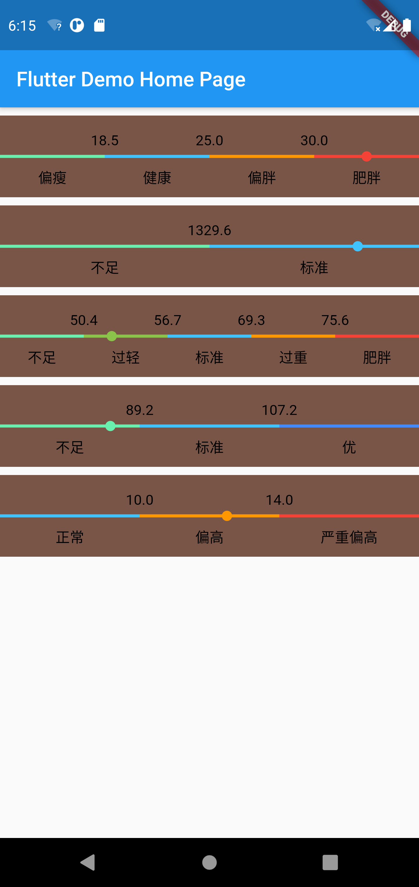

# 水平多段显示小部件

## 参数：
| 参数 |必填 |类型 | 说明 |
| :------------- |:-------------|:-------------|:-------------|
| defaultValue | 是 | double | 值 |
|doubleValues|是|List\<double\>|区间|
|stringValues|是|List\<String\>|区间提示|
|colorValues|是|List\<Color\>|区间颜色|
|strokeWidth|否|double|线的宽度，默认 3|
|radius|否|double|线上圆的半径，默认 5|
|textStyle|否|TextStyle|文字风格， 默认 TextStyle(fontSize: 14,color: Colors.black)|
|textAlign|否|TextAlign|文字对齐方式，默认 TextAlign.center|
|textDirection|否|TextDirection|文字方向，默认 TextDirection.ltr|
    
## 使用：
    double defaultValue = 37.5;
    List<double> doubleValues = [0, 18.5, 25.0, 30.0, 45.0,];
    List<String> stringValues = ['偏瘦', '健康', '偏胖', '肥胖',];
    List<Color> colorValues = [Colors.greenAccent, Colors.lightBlueAccent, Colors.orange, Colors.red,];
      
    Container(
      width: MediaQuery.of(context).size.width,
      height: 80,
      color: Colors.brown,
      margin: EdgeInsets.only(top: 8),
      child: HorizontalMultiSegmentDisplayWidget(
        defaultValue, doubleValues, stringValues, colorValues,
      ),
    )
